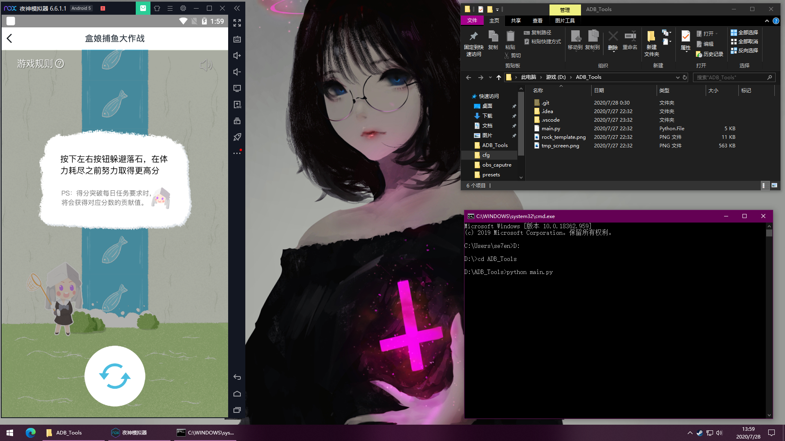
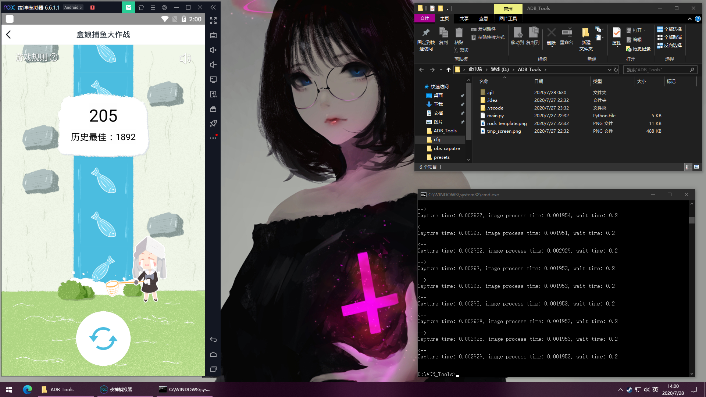

# 小黑盒三周年捕鱼大作战工具  

活动就不介绍了，脸黑，抽奖全是H币，希望大家都是欧皇！其中的盒娘捕鱼大作战任务，可能是手速不行，
怎么点都不能够 200 分，一怒之下写个 python 脚本来刷分。此脚本稳定 200 分以上，后面的参数自己可以尝试
修改，我刷了 1892 分就强制结束了。这个任务你点的越快，会给你加时间，所以理论上无限刷分。

## 所需软件  

本来尝试用ADB来控制安卓手机，但是ADB的截图和按键命令用时实在太长。又是一怒之下就用了安卓模拟器。  
1. 安装夜神模拟器（我试了蓝叠，点击鼠标的指令无效，可能是屏蔽了，夜神起作用）。  
2. 安装python3.7
3. 下载此项目并解压。
4. 打开 cmd.exe，切换目录到此文件夹下，使用命令 `pip install -r requirement.txt` 安装python所需包。

## 跑分启动 

1. 打开安卓模拟器，打开小黑盒，打开捕鱼界面，将窗口放在一边，保证不会被其他窗口遮挡。   

2. 在cmd窗口中输入 `python main.py`,按下回车后双手离开键盘鼠标，开始刷分。  
3. 如果刷分错误，或者倒计时结束，脚本会自动停止，刷分过程中不要移动鼠标。
4. 脚本有一个命令行参数是每次点击后的等待时间，默认是0.2秒，命令
`python main.py 0.2`等价于上面的命令。理论上等待时间越小，刷分越快，分数也越高。
我使用0.1秒的等待时间刷到 1892 分。   

## 最后 

祝大家欧皇附体！